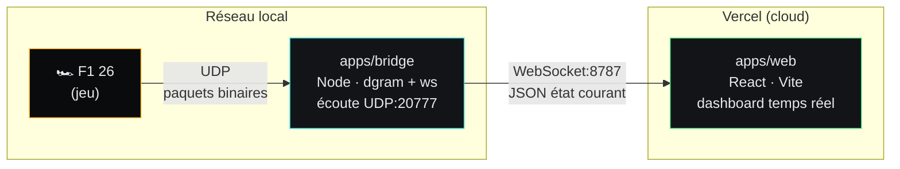

# F1 26 Telemetry Dashboard

Dashboard de télémétrie temps réel pour F1 26 : un pont Node écoute le flux UDP émis par le jeu et le relaie en WebSocket vers un frontend React qui l'affiche façon pit wall (vitesse, régime, rapport, pédales, pneus, tour/secteur).

## Architecture



Le jeu diffuse ses paquets de télémétrie en UDP sur le réseau local. `apps/bridge` les écoute, les parse et republie en continu un état JSON simplifié à tous les clients WebSocket connectés. `apps/web` s'y connecte et affiche le dashboard en temps réel.

**Point important** : le bridge doit tourner sur une machine qui reçoit effectivement les paquets UDP du jeu (donc sur le même PC, ou sur le même réseau local avec l'IP du bridge renseignée dans les réglages du jeu). Vercel n'héberge que le frontend — il ne peut pas recevoir de flux UDP ni faire tourner un socket persistant.

## Structure du repo

```
.
├── apps/
│   ├── web/            # Frontend React (Vite) — déployé sur Vercel
│   └── bridge/          # Pont UDP -> WebSocket — tourne en local/LAN
├── pnpm-workspace.yaml
├── package.json
├── eslint.config.js
├── .prettierrc
├── commitlint.config.js
├── .husky/
├── .github/workflows/ci.yml
└── vercel.json
```

## Configuration du jeu

Dans F1 26 : `Game Options > Settings > Telemetry Settings`

| Paramètre           | Valeur                                                        |
|---------------------|-----------------------------------------------------------------|
| UDP Telemetry        | On                                                               |
| UDP IP Address        | `127.0.0.1` si le bridge tourne sur le même PC, sinon l'IP locale de la machine qui héberge le bridge |
| UDP Port              | `20777`                                                          |
| UDP Send Rate         | 60Hz                                                             |
| UDP Format            | 2026                                                             |

## Installation

```bash
pnpm install
```

## Lancer en local

Dans deux terminaux séparés :

```bash
pnpm dev:bridge   # écoute l'UDP du jeu, sert le WebSocket sur ws://localhost:8787
pnpm dev:web      # lance le frontend sur http://localhost:5173
```

Le frontend se connecte par défaut à `ws://localhost:8787` (configurable via `VITE_WS_URL` dans `apps/web/.env`, voir `.env.example`).

## Déploiement du frontend sur Vercel

1. Importer le repo dans Vercel
2. Si le monorepo n'est pas auto-détecté : Project Settings → Root Directory = `apps/web`, Build Command = `pnpm build`, Output Directory = `dist`
3. Ajouter la variable d'environnement `VITE_WS_URL` :
    - laissée vide / `ws://localhost:8787` si tu regardes toujours le dashboard depuis le PC qui héberge le bridge (les navigateurs autorisent le WebSocket non chiffré vers `localhost` même depuis une page HTTPS)
    - sinon, une URL `wss://...` pointant vers un tunnel (Tailscale, Cloudflare Tunnel, ngrok) exposant le bridge en HTTPS/WSS, si tu veux consulter le dashboard depuis un autre appareil

Le pont (`apps/bridge`) n'est pas déployé — il continue de tourner en local à chaque session de jeu.

## Conventions du projet

- Code en anglais, commentaires et messages de commit en français
- [Conventional Commits](https://www.conventionalcommits.org/fr/) imposés via commitlint + Husky (`feat:`, `fix:`, `chore:`, `docs:`, ...)
- pnpm workspaces pour le monorepo
- ESLint + Prettier
- CI GitHub Actions : lint + build sur chaque push/PR

## Scripts disponibles

| Commande            | Description                                  |
|----------------------|-----------------------------------------------|
| `pnpm dev:bridge`     | Lance le pont UDP → WebSocket en local        |
| `pnpm dev:web`        | Lance le frontend en mode développement       |
| `pnpm build:web`      | Build de production du frontend               |
| `pnpm lint`           | Lint de tout le monorepo                      |
| `pnpm format`         | Formatage avec Prettier                       |